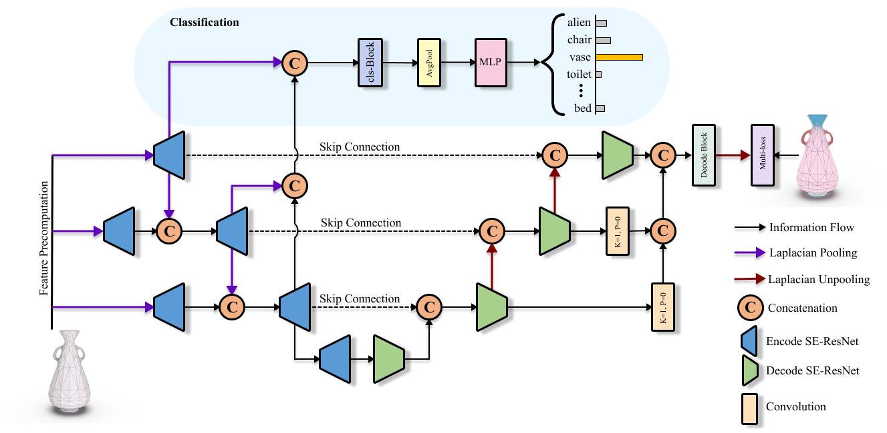

# Laplacian2Mesh: Laplacian-Based Mesh Understanding

### [Project](https://qiujiedong.github.io/publications/Laplacian2Mesh/) | [Paper](https://arxiv.org/pdf/2202.00307.pdf)

**This repository is the official PyTorch implementation of our paper,  *Laplacian2Mesh: Laplacian-Based Mesh Understanding*.**



## News
- :fire: This paper was accepted by [IEEE TVCG](https://ieeexplore.ieee.org/document/10076837)
- :star: Gave a talk at [CVM2023](http://iccvm.org/2023/index.htm) on Laplacian2Mesh.


## Getting Started

### Requirements

- python 3.7
- CUDA 11.3
- Pytorch 1.10.0

### Installation

clone this repo: 

```
git clone https://github.com/QiujieDong/Laplacian2Mesh.git
cd Laplacian2Mesh
```

### Fetch Data

This repo provides training scripts for classification and segmentation on the following datasets:

- SHREC-11
- manifold40
- humanbody
- coseg_aliens
- coseg_chairs
- coseg_vases

To download the preprocessed data, run

```
sh ./scripts/<DATASET_NAME>/get_data.sh
```

> The `coseg_aliens`, `coseg_chairs`, and `coseg_vases` are downloaded via the script of `coseg_aliens`.
> This repo uses the original `Manifold40` dataset without re-meshing via the Loop Subdivision.

### Preprocessing

To get the input features by preprocessing:

```
sh ./scripts/<DATASET_NAME>/prepaer_data.sh
```

> The operation of preprocessing is One-time.

### Training

To train the model on the provided dataset(s) in this paper, run this command:

```
sh ./scripts/<DATASET_NAME>/train.sh
```

### Evaluation

To evaluate the model on a dataset, run:

```
sh ./scripts/<DATASET_NAME>/test.sh
```

### Visualize

After testing the segmentation network, there will be colored shapes in the `visualization_result` directory.

## Cite

If you find our work useful for your research, please consider citing the following papers :)

```bibtex
@article{dong2023laplacian2mesh,
  title={Laplacian2mesh: Laplacian-based mesh understanding},
  author={Dong, Qiujie and Wang, Zixiong and Li, Manyi and Gao, Junjie and Chen, Shuangmin and Shu, Zhenyu and Xin, Shiqing and Tu, Changhe and Wang, Wenping},
  journal={IEEE Transactions on Visualization and Computer Graphics},
  year={2023},
  publisher={IEEE}
}
```


## Acknowledgments
Our code is inspired by [MeshCNN](https://github.com/ranahanocka/MeshCNN/) and [SubdivNet](https://github.com/lzhengning/SubdivNet).


